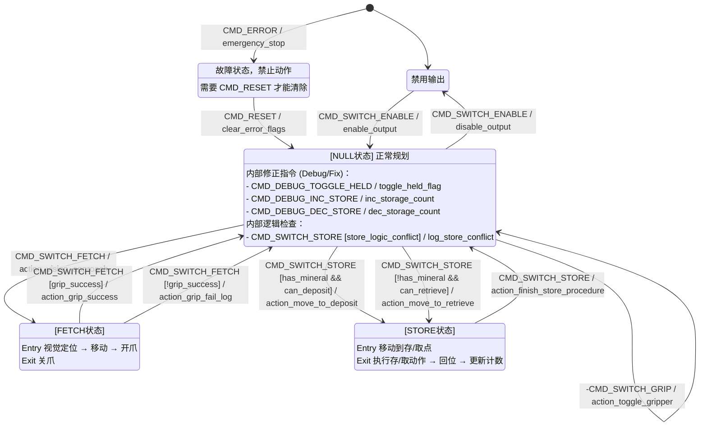

## Packet内容

- x,y,z,r,p,y绝对值
- 代表不同状态的一个 uint8_t enum

## Packet来源

下位机C板USB通信

### 位置绝对值来源

- 连接到自定义控制器（在总线上检测到自定义控制器包）时：从自控获取
- 未连接到自定义控制器时：从遥控器获取xyzrpy（ls上+rs上->左摇杆xy,右摇杆z; ls上+rs中->
  左摇杆yr,右摇杆p，此时下位机程序里底盘应该给0的ref)

### 状态enum来源

遥控器+键盘

单遥控器：ls中/下时，拨动滚轮持续0.5s，根据rs的位置发出对应的状态。滚轮为0时状态发NULL

- ls中
    - rs上：SWITCH_ENABLE
    - rs中：RESET
    - rs下：FETCH
- ls下
    - rs上：SWITCH_STORE
    - rs中：SWITCH_GRIP

键盘：

## 机械臂上位机指令集 (Command List)

| 指令枚举 (Enum)             | 功能描述 (Function)                                                                             |
|:------------------------|:--------------------------------------------------------------------------------------------|
| **`CMD_ERROR`**         | **急停**。立即停止所有动作并跳转至 `ErrorMode`（故障状态）。                                                      |
| **`CMD_SWITCH_ENABLE`** | **启用/禁用输出**。在 `Disabled`（禁用）和 `ManualControl`（手动控制）状态之间切换。                                  |
| **`CMD_RESET`**         | **复位**。<br>1. 在 `ErrorMode` 下：清除错误标志，恢复到手动模式。<br>2. 在 `ManualControl` 下：清除运动控制的位置累积值（重置原点）。 |
| **`CMD_SWITCH_FETCH`**  | **切换抓取模式**。<br>**进入**：执行视觉定位并移动到预备点，张开夹爪。<br>**退出**：闭合夹爪，返回原位，并根据传感器结果更新“持有状态”。             |
| **`CMD_SWITCH_STORE`**  | **切换存取模式**。<br>**进入**：根据当前是否持有矿石及库存量，自动规划移动到存矿或取矿点。<br>**退出**：执行存/取动作，返回原位，并自动更新库存计数。       |
| **`CMD_SWITCH_GRIP`**   | **手动夹爪开关**。仅在 `ManualControl` 模式下有效，用于手动控制夹爪的开合。                                            |
| **`CMD_TOGGLE_HELD`**   | **[调试] 强制切换持有状态**。手动修改 `has_mineral` 标志位（用于视觉/传感器误判时的修正）。                                   |
| **`CMD_INC_STORE`**     | **[调试] 库存计数 +1**。强制增加逻辑库存数量。                                                                |
| **`CMD_DEC_STORE`**     | **[调试] 库存计数 -1**。强制减少逻辑库存数量。                                                                |

## 代码

```c++
enum class YandyControlCmd : uint8_t
{
    CMD_NONE = 0x00, // 心跳/无操作

    // === 系统级指令 (System) ===
    CMD_ERROR = 0x01, // 急停 (Emergency Stop) - 最高优先级
    CMD_SWITCH_ENABLE = 0x02, // 启用/禁用输出 (Enable Toggle)
    CMD_RESET = 0x03, // 复位 (Reset Error / Clear Accumulators)

    // === 模式切换指令 (Mode Switching) ===
    CMD_SWITCH_FETCH = 0x10, // 进入/退出 抓取模式 (Fetch Toggle)
    CMD_SWITCH_STORE = 0x11, // 进入/退出 存取矿模式 (Store Toggle)

    // === 手动操作指令 (Manual Action) ===
    CMD_SWITCH_GRIP = 0x20, // 手动切换夹爪 (Gripper Toggle)

    // === 调试/修正指令 (Debug / Override) ===
    CMD_TOGGLE_HELD = 0x80, // 强制修改“持有矿石”状态
    CMD_INC_STORE = 0x81, // 强制库存 +1
    CMD_DEC_STORE = 0x82 // 强制库存 -1
};
```

## 状态图



## 键盘键位设定

