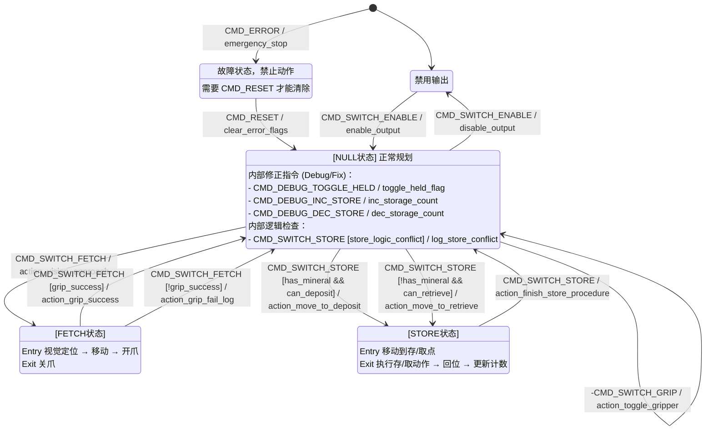

## Packet内容

- x,y,z,r,p,y绝对值
- 代表不同状态的一个 uint8_t enum

## Packet来源

下位机C板USB通信

### 位置绝对值来源

- 连接到自定义控制器（在总线上检测到自定义控制器包）时：从自控获取
- 未连接到自定义控制器时：从遥控器获取xyzrpy（ls上+rs上->左摇杆xy,右摇杆z; ls上+rs中->
  左摇杆yr,右摇杆p，此时下位机程序里底盘应该给0的ref)

### 状态enum来源

遥控器+键盘

单遥控器：ls中/下时，拨动滚轮持续0.5s，根据rs的位置发出对应的状态。滚轮为0时状态发NULL

- ls中
    - rs上：SWITCH_ENABLE
    - rs中：RESET
    - rs下：FETCH
- ls下
    - rs上：SWITCH_STORE
    - rs中：SWITCH_GRIP

键盘：

## 状态

### NULL

正常通过xyzrpy进行运动规划并输出

### SWITCH_ENABLE

切换规划和输出启用状态

### RESET

机械臂强制回到初始位置，同时清空各种累积值

### SWITCH_FETCH

切换抓取状态
抓取状态：通过视觉检测，定位到合适的位置，打开夹爪，检测绝对值并进行微调。
再按一下进行夹取并返回原位。

### SWITCH_STORE

切换存取矿/正常模式
首先检测末端上是否有矿；
如果有矿，将矿带到空余的杆上，检测绝对值并进行微调。
如果没有矿，就从有矿的杆子上进行取矿，检测绝对值进行微调。
切回正常模式时，会松开末端执行器并回到存矿之前的位置

### SWITCH_GRIP

切换夹爪夹取状态

## 状态图

